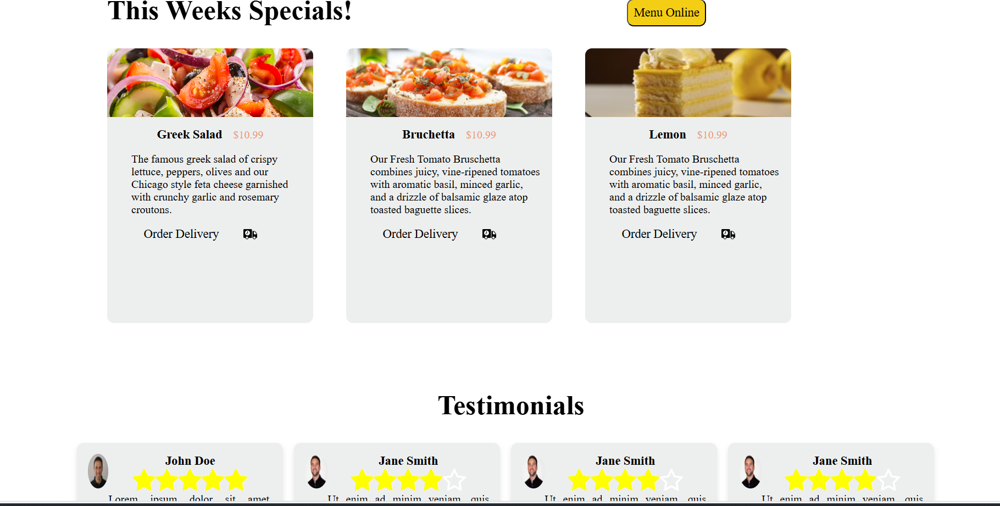
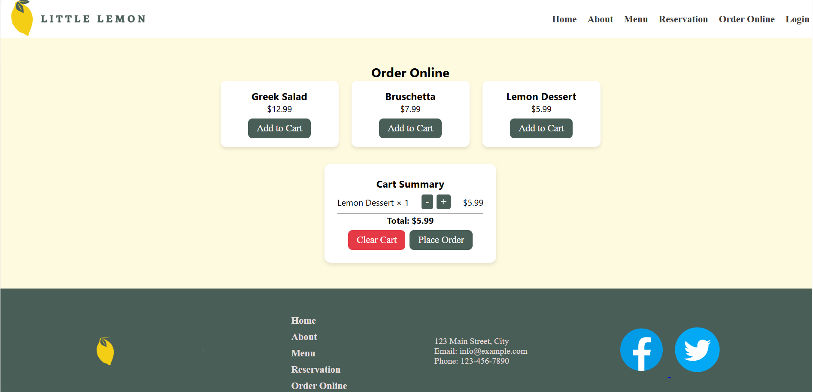
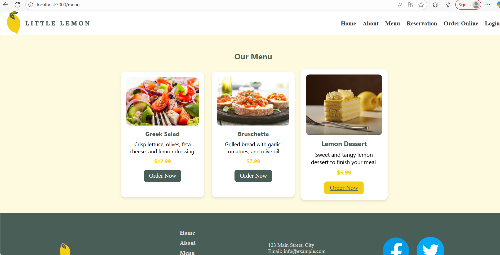

# 🍋 Little Lemon Restaurant

A responsive and modern restaurant website built with **React.js** for online ordering, menu browsing, and reservation management.  
The project is inspired by the *Little Lemon* brand from the Meta Front-End Developer Capstone.

---

## 🚀 Features

- 🧭 **Home Page:** Elegant landing page introducing the restaurant.  
- 🍽️ **Menu Page:** Browse dishes with images, prices, and categories.  
- 🛒 **Order Online:** Add items to cart, view cart summary, and clear/decrease items.  
- 🔐 **Login Page:** User authentication page styled to match the restaurant theme.  
- 📱 **Responsive Design:** Works smoothly on desktop, tablet, and mobile devices.  
- 🎨 **Consistent Theme:** Styled with CSS/Tailwind for a clean and cohesive look.  

---

## 🛠️ Tech Stack

| Category | Technology |
|-----------|-------------|
| Frontend | React.js |
| Styling | CSS / TailwindCSS |
| Deployment | GitHub Pages |
| Version Control | Git & GitHub |

---

## 📸 Screenshots

### 🏠 Home Page



### 🛒 Order Online

### menu



---
---
🌍 Live Demo
Check out the live website here: [Live Demo](https://username.github.io/repo-name/)


## ⚙️ Installation & Setup

1. **Clone the repository**
   ```bash
   git clone https://github.com/pawan-7218/LITTLE-LEMON.git
Install dependencies

bash
Copy code
npm install
Run locally

bash
Copy code
npm start
Deploy to GitHub Pages

bash
Copy code
npm run deploy